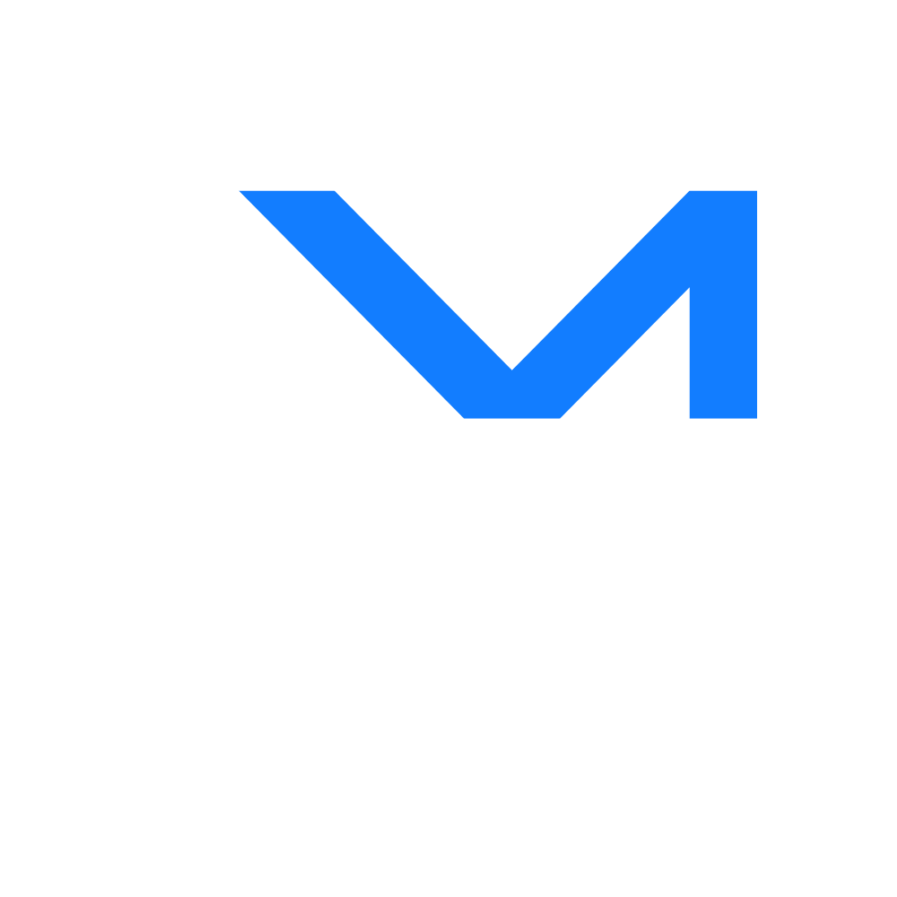

# NexusMart - Your E-commerce Destination
Y2-MERN-project - UCSC CS - 2019/2020 - devXcrew

NexusMart is an advanced e-commerce platform developed as a group project by five dedicated members from the University of Colombo School of Computing during our second year, first semester. It is designed to provide a seamless shopping experience, offering a wide range of products and features.

## Table of Contents

- [Introduction](#introduction)
- [Features](#features)
- [Technologies Used](#technologies-used)
- [Getting Started](#getting-started)
- [Usage](#usage)
- [Contributing](#contributing)
- [License](#license)

## Introduction

NexusMart aims to revolutionize online shopping by providing a feature-rich and user-friendly platform for buyers and sellers. Our platform ensures a smooth and secure shopping experience with an intuitive interface and a robust backend.

## Features

- **User Authentication**: Secure user registration and authentication system.
- **Product Catalog**: Browse various products organized into categories.
- **Product Details**: Get detailed information about each product, including images and descriptions.
- **Shopping Cart**: Add products to your cart and manage your shopping list.
- **Checkout Process**: Seamless and secure checkout with multiple payment options.
- **Order History**: View and track your order history.
- **Seller Dashboard**: Sellers can manage products, view orders, and interact with customers.
- **Admin Panel**: Administrators can manage users, products, and overall system settings.
- **Reviews and Ratings**: Leave feedback and ratings for products and sellers.
- **Search Functionality**: Easily find products using the search feature.
- **Responsive Design**: Enjoy a consistent experience on both desktop and mobile devices.

## Technologies Used

- **Frontend**:
  - React.js for building the user interface.
  - Redux for state management.
  - HTML, CSS, and JavaScript for front-end development.

- **Backend**:
  - Node.js with Express.js for the server.
  - MongoDB is the database for storing product and user information.

## Getting Started
Follow these steps to set up and run NexusMart on your local machine:

1. Clone the repository:
   git clone https://github.com/sahan462/nexusmart-e-commerce-platform.git

2. Navigate to the project directory:
   cd nexusmart

4. Install dependencies for the server:
   cd server
   npm install

6. Install dependencies for the client:
   cd ../client
   npm install

8. Start the client:
  cd ../client
  npm start

## Contributing
If you'd like to contribute to this project, please follow these steps:
- Fork the repository on GitHub.
- Clone your fork locally.
- Create a new branch with a descriptive name.
- Make your changes and commit them with clear messages.
- Push your branch to your fork on GitHub.
- Create a pull request on the original repository.
  
## License
This project is licensed under the MIT License. See the LICENSE file for details.

